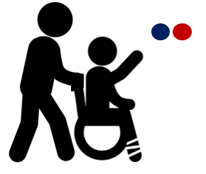

<p align="center">
  
</p>

<h1 align="center">Wheelchair-Door-AI</h1>

<p align="center">
  경성대 <strong>인공지능 플랫폼</strong> 수업 팀 프로젝트 – 휠체어 감지 자동문 시스템 구현 
</p>

---

## 🦽 프로젝트 개요

휠체어 사용자들이 화장실 문을 직접 열기 힘든 현실을 개선하기 위해,  
**AI 이미지 분석을 통해 휠체어 사용자를 감지하고, 자동문을 열 수 있는 시스템**을 구축했습니다.

> 라즈베리파이 + 카메라 + TensorFlow 모델을 활용한 접근성 보조 시스템입니다.

---

## ⚙️ 시스템 구성

- **카메라**: Picamera2
- **AI 모델**: EfficientNetB3 기반 이진 분류
- **컨트롤러**: Raspberry Pi + GPIO 제어 (gpiod)
- **모터**: 스텝모터 28BYJ-48
- **입력 데이터**: 휠체어 / 비휠체어 이미지 약 5,000장 이상 수집
- **감지 기준**: 추론 결과 `≥ 0.5` 시 문 개방

---

## 💻 라즈베리파이 제어 흐름

- 실시간 카메라 영상 → 모델 추론
- 휠체어 감지 시 GPIO 핀을 통해 스텝모터 회전
- 이후 자동으로 다시 반대방향으로 닫힘

> 관련 코드: `rpi/main_pi_controller.py`

---

## 🌊 시스템 흐름 요약

1. **카메라 영상 입력**
2. **모델 추론 → 휠체어 확률 측정**
3. **0.5 이상일 경우 → 모터 작동 (자동문 개폐)**
4. **그 외에는 대기 상태 유지**

---

## 🧪 실험 설정

총 3가지 실험 모델을 구성해 훈련 성능을 비교했습니다:

| 실험명 | 특징 |
|--------|------|
| `exp1` | 이미지 증강 강화 |
| `exp2` | Dropout 증가 |
| `exp3` | Learning Rate 감소 |

---

## 📂 주요 디렉토리 구조
```
wheelchair-door-ai/
├── images/ # README에서 사용될 시각 자료
├── model/ # 학습된 모델 
├── rpi/ # 라즈베리파이 실시간 제어 스크립트
│   └── main_pi_controller.py
├── scripts/ # 전체 파이프라인 구성 스크립트
│   ├── crawl_wheelchair_images.py
│   ├── crawl_nonwheelchair_images.py
│   ├── resize_wheelchair_images.py
│   ├── resize_nonwheelchair_images.py
│   ├── remove_duplicates_wheelchair.py
│   ├── remove_duplicates_nonwheelchair.py
│   ├── train_baseline_model.py
│   ├── train_final_model.py
│   └── train_multi_experiments.py
├── dataset/ # 실제 이미지는 GitHub에 포함되지 않음
│   └── .gitkeep
├── requirements.txt
└── README.md

```

## 📉 한계 및 개선

| 한계 | 개선 방향 |
|------|-----------|
| 휠체어 탐지 정확도 낮음 | Object Detection 기반(YOLOv8)으로 전환 |
| CPU 추론 느림 | Jetson Nano 또는 GPU 기반 시스템 전환 |
| 적외선 센서 미활용 | 실내 감지 보조용으로 적외선 센서 추가 |

---

## 📦 데이터셋 제공 안내

> 원본 이미지(`wheelchair_raw`, `nonwheelchair_raw`)는 총 10,000장 이상이며,  
> GitHub 용량 제한으로 인해 업로드되지 않았습니다.  

---

## ⚠️ 코드 유사성 및 라이선스 안내

본 프로젝트의 일부 모델 구성 및 학습 코드 구조는 TensorFlow/Keras 공식 문서와  
일반적인 이진 분류 예제를 참고하여 작성하였습니다.  
구조 유사성은 API 사용 방식에 기반한 것으로, 전체 코드 흐름 및 실험 설계는  
본 프로젝트의 목적에 맞게 직접 구성되었습니다.

---

## 🧑‍💻 개발자 정보

- 김민성 – 경성대학교 컴퓨터공학과
- 이재민 - 경성대학교 소프트웨어학과
- 이승준 - 경성대학교 소프트웨어학과

- 프로젝트명: `Wheelchair-Door-AI`  
- 기간: 2025년 1학기 (인공지능 플랫폼 강의)

---

> 이 프로젝트는 동그라미 탐지 수준에서 마무리되었지만, 추후에는 실제 휠체어 객체 탐지 기반의 완성도를 목표로 도전할 예정입니다.
